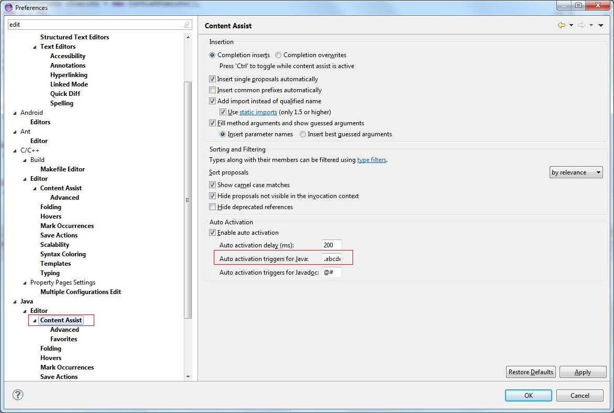

# shortcuts/ Ctrl + 点击 = Open declaration/implementation
# shortcuts/ F4 =  选中元素的继承层次
# shortcut/ctrl+shift+t search any classes
# shortcut/Alt+ / = 代码提示
同时，Eclipse中也有一个代码提示的快捷键:Alt+/；这个快捷键的名称就叫Content Assist。
http://blog.csdn.net/hyr83960944/article/details/38388429

# settings/ content assist = 自动提示
相信很多人在用Eclipse的时候，很习惯的都会把Content Assist设置成.abcd...z，这样每次敲代码的时候都会有自动提示，写起代码来很方便。具体设置如图：

http://blog.csdn.net/hyr83960944/article/details/38388429
